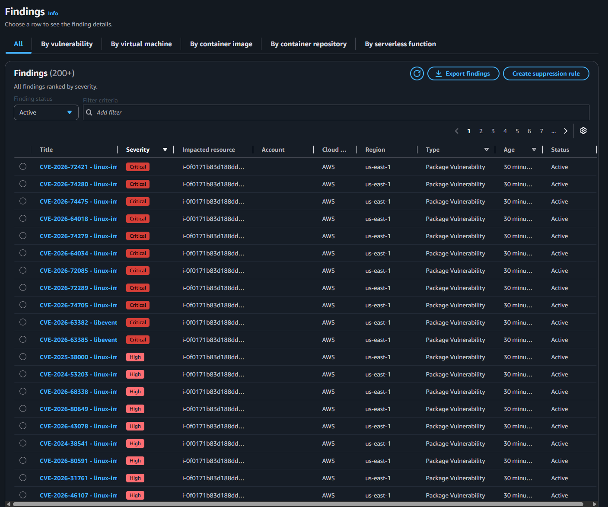
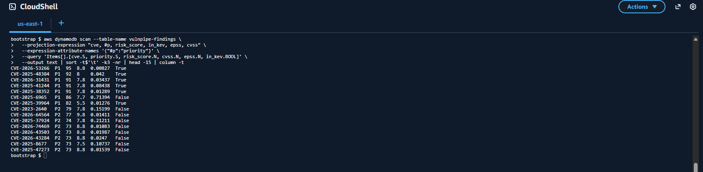
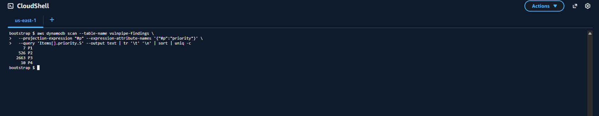
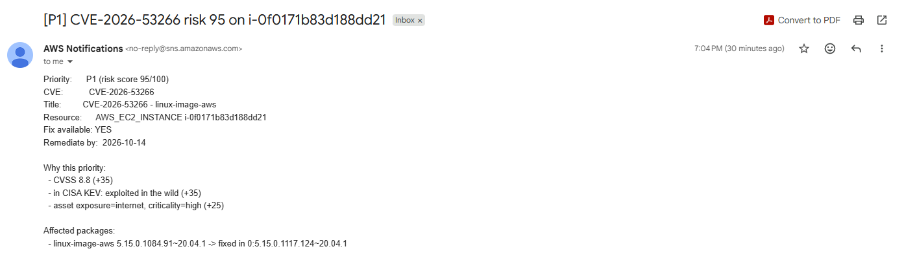
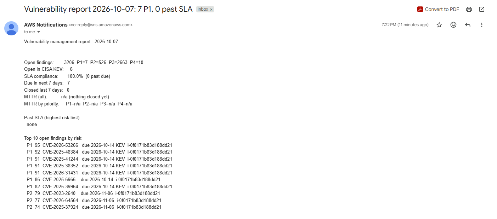
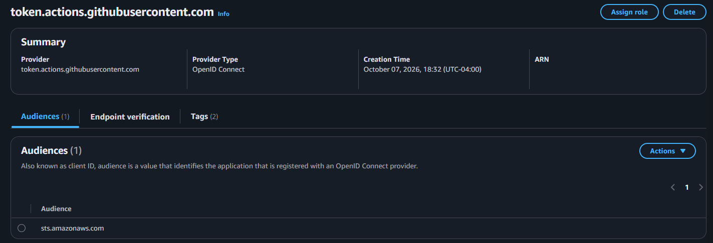

# AWS Vulnerability Management Pipeline

An automated vulnerability management pipeline on AWS. Container images and
infrastructure code are scanned before deployment, running workloads are
scanned continuously with Amazon Inspector, and a Python risk engine
prioritizes CVEs using CVSS, EPSS, and the CISA Known Exploited
Vulnerabilities (KEV) catalog instead of CVSS alone.

> **Status:** Complete. All phases were deployed and verified end to end on
> AWS, then torn down. Everything can be redeployed from this repository.

## Architecture

```
 git push
    │
    ▼
 GitHub Actions ─► Trivy image scan + Trivy config scan ─► gate (block on CRITICAL)
    │                     └─► SARIF ─► GitHub Security tab
    │  OIDC (short-lived credentials, no stored keys)
    ▼
 AWS, deployed with Terraform
 ┌──────────────────────────────────────────────────────────────────────────┐
 │ Amazon Inspector ──finding event──► EventBridge ──► Lambda: risk engine   │
 │  (EC2, ECR, Lambda)                                  │  CVSS + EPSS +     │
 │        │                                             │  CISA KEV + asset  │
 │        └──► Security Hub (aggregation)               │  context           │
 │                                                      ├─► DynamoDB (record)│
 │                                                      └─► SNS (P1 alert)   │
 │ EventBridge schedule (Mondays) ──► Lambda: report ──► SNS (metrics email) │
 └──────────────────────────────────────────────────────────────────────────┘
```

## Results

Deployed against one deliberately outdated Ubuntu 20.04 instance:

- Inspector reported **3,206** package vulnerabilities on a single server.
- The risk engine scored all of them and flagged **7 as P1**: 526 P2,
  2,663 P3, 10 P4. Each P1 produced exactly one alert email.
- Examples of risk-based prioritization versus CVSS alone:

| CVE | CVSS | EPSS | In CISA KEV | Risk | Priority | Why |
|---|---|---|---|---|---|---|
| CVE-2025-39964 | 5.5 | 0.013 | Yes | 82 | **P1** | Medium CVSS, but actively exploited |
| CVE-2025-6965 | 7.7 | 0.714 | No | 86 | **P1** | 71% probability of exploitation in 30 days |
| CVE-2026-64564 | 9.8 | 0.014 | No | 77 | P2 | Near-maximum CVSS, but little exploitation evidence |

### Screenshots

**Amazon Inspector findings on the scan target** (3,206 package vulnerabilities, ranked by CVSS severity only)



**Risk engine output: the 15 highest-risk findings.** Columns: CVE, priority, risk score, CVSS, EPSS, in CISA KEV.



**Priority distribution: 3,206 findings, 7 that need action this week**



**P1 alert email**, explaining why the finding is P1 and what to upgrade



**Weekly metrics report email**



**GitHub OIDC identity provider in AWS IAM** (no long-lived access keys)



## Phases

| Phase | Scope | Status |
|---|---|---|
| 1 | Pre-deployment scanning: Trivy in GitHub Actions, SARIF upload, build gates | Done |
| 2 | AWS infrastructure in Terraform, GitHub OIDC (no stored keys) | Done |
| 3 | Risk engine Lambda: CVSS + EPSS + KEV + asset context, SLA routing | Done |
| 4 | Weekly metrics report: open by priority, SLA compliance, MTTR | Done |
| 5 | Documentation, teardown | Done |

## Phase 1: Pre-deployment scanning

Workflow: [`.github/workflows/security-scan.yml`](.github/workflows/security-scan.yml)

| Job | What it checks | Blocks the build when |
|---|---|---|
| Container image scan | OS packages and Python dependencies in the built image | A **CRITICAL** vulnerability with an available fix exists |
| Config scan | Dockerfile and IaC misconfigurations | A **HIGH** or **CRITICAL** misconfiguration exists |

Every finding, at all severities, is uploaded to the repository's
**Security → Code scanning** tab as SARIF, so the gate only decides what
blocks; nothing is hidden.

### Before and after

`app/` contains a minimal Flask service. It was first committed in a
deliberately outdated image so the pipeline had real findings to act on:

- `python:3.8-slim-buster`: end-of-life Python on end-of-life Debian 10
- `PyYAML 5.3.1`: CVE-2020-14343, arbitrary code execution (CVSS 9.8)
- Outdated `Werkzeug` and `requests` with known CVEs
- Container runs as root (Trivy `DS-0002`)

**Before:** the gates blocked the build (CRITICAL CVEs, root container).

**After** (remediation commit): `python:3.13-slim` base, every dependency
upgraded past its CVEs, an unprivileged `appuser`, and a `HEALTHCHECK`. The
same gates pass. Both runs remain in the Actions history as evidence.

## Phase 2: AWS infrastructure

Two Terraform stacks:

| Stack | Deployed by | Creates |
|---|---|---|
| [`bootstrap/`](bootstrap/) | Once, manually, from AWS CloudShell | S3 state bucket (versioned, encrypted, TLS-only), GitHub OIDC provider, deploy role |
| [`infra/`](infra/) | GitHub Actions ([`deploy-infra.yml`](.github/workflows/deploy-infra.yml)) | Inspector (EC2/ECR/Lambda), Security Hub, ECR, KMS key, SNS alerts, DynamoDB findings table, scan target EC2 |

### Security decisions

- **No long-lived AWS keys.** Bootstrap runs in CloudShell with the console
  session's temporary credentials. GitHub Actions gets short-lived credentials
  through OIDC, and the role trusts only this repository's `main` branch.
- **Least privilege for the pipeline.** The deploy role has `PowerUserAccess`
  (which excludes IAM) plus IAM permissions scoped to `vulnpipe-*` roles only,
  so the pipeline cannot create or modify any other identity.
- **Encryption at rest with a customer managed KMS key** (rotation enabled)
  for alerts and findings data.
- **Locked-down scan target.** The intentionally vulnerable EC2 instance has no
  inbound rules, no SSH key, IMDSv2 only, and an encrypted disk. It is
  vulnerable on paper (package CVEs) but not reachable.
- **OIDC trust pinned to immutable IDs.** GitHub's token subject includes the
  numeric account and repository IDs, and the role trusts those, so a deleted
  and re-created account or repository with the same name cannot assume it.
- **The infrastructure code passes the same gate as the app.** Trivy scans the
  Terraform on every push. Accepted risks are suppressed inline with a written
  justification (`#trivy:ignore`), never silently.

## Phase 3: Risk engine

Code: [`lambda/risk_engine/`](lambda/risk_engine/) · Tests: [`tests/`](tests/)

Every Inspector finding event (created, updated, closed) triggers a Python
Lambda through EventBridge. CVSS alone measures how bad a vulnerability
*could* be; most "critical" CVEs are never exploited. The engine answers
three questions and combines them into a 0-100 score:

| Question | Signal | Points |
|---|---|---|
| How bad if exploited? | CVSS base score (NVD v3 preferred) | 0-40 |
| Is it being exploited? | **CISA KEV** (confirmed in the wild) = max; otherwise **EPSS** probability, plus public exploit availability | 0-35 |
| Does this asset matter? | Asset tags `vulnpipe:exposure` and `vulnpipe:criticality` | 0-25 |

| Priority | Rule | Remediation SLA |
|---|---|---|
| P1 | In CISA KEV, or score >= 80 | 7 days |
| P2 | Score 60-79 | 30 days |
| P3 | Score 40-59 | 90 days |
| P4 | Below 40 | 180 days |

The SLA clock starts at Inspector's *first observed* time. SLAs and alerting
priorities are Terraform variables.

**What happens to each finding**

- Upserted into DynamoDB with score, priority, the reasons behind the score,
  SLA due date, and affected packages. This is the system of record for
  reporting.
- P1 findings trigger one SNS email. A conditional write guarantees exactly
  one alert per finding, even though Inspector re-sends update events.
- When Inspector closes a finding (patched or resource removed), `closed_at`
  is recorded so time-to-remediate can be measured.
- Feed outages degrade gracefully: if KEV or EPSS is unreachable, the finding
  is still recorded with the signals that are available.
- Findings that existed before the engine was deployed are scored with a
  one-time backfill: `aws lambda invoke --function-name vulnpipe-risk-engine
  --payload '{"backfill": true}' --cli-binary-format raw-in-base64-out out.json`

The scoring and handler logic are covered by unit tests that run on every
push, with no AWS account or network access needed.

## Phase 4: Weekly metrics report

Code: [`lambda/report/report.py`](lambda/report/report.py)

Every Monday an EventBridge schedule runs a second Lambda that reads the
findings table and emails the program-level metrics:

| Metric | Why it matters |
|---|---|
| Open findings by priority, and how many are in CISA KEV | Current exposure at a glance |
| SLA compliance and the list of past-due findings | Are we meeting our remediation commitments? |
| Findings due in the next 7 days | What the team should work on this week |
| MTTR (mean time to remediate), overall and per priority | Are we getting faster? The KPI auditors and managers track |
| Top open findings by risk score | Where to start |

MTTR is measured from Inspector's *first observed* time to the moment
Inspector closes the finding, both recorded by the risk engine.

## Deploy and tear down

**Deploy**

1. In AWS CloudShell: `cd bootstrap && terraform init && terraform apply`
   (creates the state bucket and the GitHub OIDC role).
2. Set the repository variables `AWS_ROLE_ARN`, `TF_STATE_BUCKET`
   (from the bootstrap outputs) and `ALERT_EMAIL`.
3. Actions → **Deploy Infrastructure** → `apply`. Confirm the SNS email
   subscription.
4. Optional: score findings that predate the engine with the backfill
   command in Phase 3.

**Tear down**

1. Actions → **Deploy Infrastructure** → `destroy`.
2. In CloudShell: empty the versioned state bucket, then `terraform destroy`
   in `bootstrap/` (its bucket is protected with `prevent_destroy`, which
   must be lifted deliberately).

**Lessons from running it**

- GitHub's OIDC subject claim now carries immutable numeric owner and
  repository IDs; the first role assumption was rejected until the trust
  policy matched them. Diagnosed by printing the token's claims, not by
  guessing.
- A single end-of-life server produced 3,206 findings, which is the case for
  risk-based prioritization in one number.
- Disabling Inspector can exceed Terraform's default 5-minute timeout;
  the enabler now has explicit timeouts.

## Tooling

Trivy 0.74.0 (pinned) · GitHub Actions · Docker · Python 3.13 · pytest ·
Terraform · Amazon Inspector · AWS Security Hub · EventBridge · Lambda ·
DynamoDB · SNS · KMS · FIRST EPSS · CISA KEV

## Author

Talha Yilmaz
